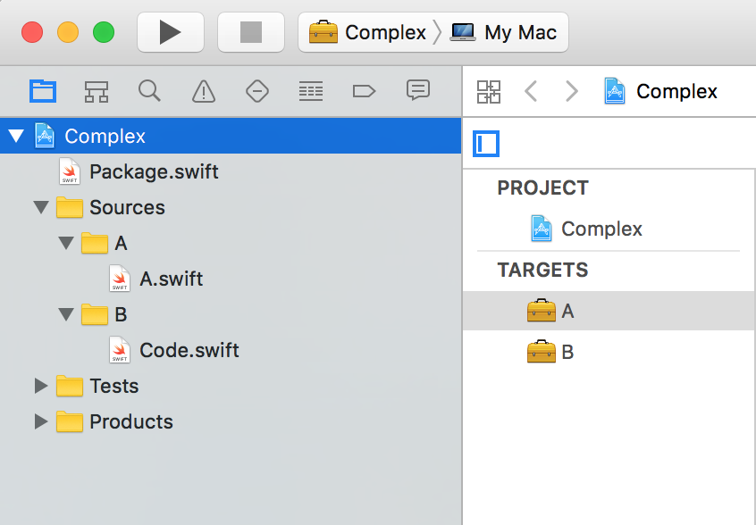
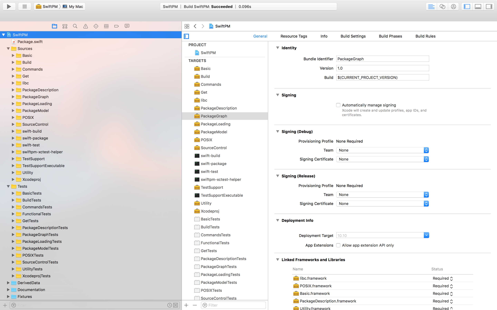

<!--# Outline: 
- Some Into
- Existing solutions (CocoaPods, Carthage)
- The problems of existing solutions
- The SwiftPM is Goal and Vision

SwiftPM Details 
- The manifest, 
- How to declare dependency + SemVersion
- 
- What can it do (fetch, build, test)
- What can it produce, lib, executable
- More advanced (System Modules)
- The source folders layout
- Extra features like 

- sem Versioning
- pkgConfig, providers

----->

#[fit] Swift Package 
#[fit] Manager 

  
# or 
##[fit] Let’s make dependency manager great, Finally!

---

Kostiantyn Koval @Agens AS 

- Swift from day 1
- Swift Hight Performance
- Swift Package Manager
- @KostiaKoval

---


#[fit] pod install

--- 

# How it used to be 🤔 ... 
- Static libraries **`lib.a`**
- Copied source
- Subproject + Workspace
- Submodules

--- 

# The problems 😢
- Closed code / Precompiled
- Hard to discover
- No versioning
- Duplicate Symbols

  ```
  a->c, b->c
  App ->(a, b) Duplicate 'c' 
  ```
  
---

# CocoaPods - *Easy* 
- Centralized
- Podspec
- Static Libs + Frameworks
- Modifies Xcode projects + workspace

 **Res**:  Workspace 

--- 

# Carthage - Simple
- Decentralized
- No Podspec
- Git + Xcode
- Frameworks  

 **Res**:  Frameworks 

---
# Happy 

^ So we are happy, NOPE

---

# Problems
- Not integrated with 🍏
- Xcode private API and Format
- Custom scripts
- Limited

---

# SwiftPM

--- 

# Why it was built? 
# 
# ~~iOS~~  Linux

---

# SwiftPM
Cross platform, Convention approach, Decentralized
     
> is a tool to automate the process of downloading, compiling, and linking dependencies.
-- Swift .org

---

# SwiftPM
#  
# Fetch     Build      Test
###  `swift package`              `swift build`                 `swift test`

---

# "swift package"
```
  clean                   Delete build artifacts
  describe                Describe the current package
  dump-package            Print parsed Package.swift as JSON
  fetch                   Fetch package dependencies
  generate-xcodeproj      Generates an Xcode project
  init                    Initialize a new package
  reset                   Reset the complete cache/build directory
  show-dependencies       Print the resolved dependency graph
  update                  Update package dependencies
```

---


#[fit] What is a `Swift Package` ?

---

#[fit] What is a `Swift Package` ?

### `Package.swift` 

```swift
import PackageDescription

let package = Package(
    name: "Empty"
)
```

---

# What is a `Swift Package` ?

- `Swift, C, C++, Objective-C, Objective-C++`
    One language per module
  
- `library (static, dynamic), executable, ` 

    `system-module`
    
---

# Package Convention  

Source in -              `/Sources`
Tests in -                  `/Tests`
Executable -            `main.swift`
Lib -                          `SomeLib.swift`
C headers -            `/include/Baz.h`

---

# Package

```
//executable                  lib with tests
.                              .
├── Package.swift              ├── Package.swift            
├── Sources                    ├── Sources
    └── main.swift             │   └── Lib.swift
							   └── Tests
							       ├── LibTests
							       │   └── LibTests.swift
							       └── LinuxMain.swift
```

--- 

# Package

```
// 2 Modules				system-module
.                           .
├── Package.swift           ├── Package.swift
└── Sources                 └── module.modulemap
    ├── A
    │   └── A.swift
    └── B
        └── someCode.swift
```

---
 
# system-module

```swift
// module.modulemap

module Clibgit [system] {
    header "/usr/local/include/git2.h"
    link "git2"
    export *
}
```

---


#[fit]     🚢   ship   IT   

---

# Package + Git = 🎉
- Step N1:

# `git init, commit, tag 0.1.0, push` 

---

# Package + Git = 🎉
- Step N2:

#  `There is no Step N2`

#                                           😀

---

# Package + Git = 🎉   

```swift
let package = Package(
    name: "Empty"
    dependencies: [
        .Package(url: "https://github.com/MyAwesomePackage", majorVersion: 0),
    ]
)

```
##     `semver, semver, semver`   ->   Semver.org


---

# Package Dependency

```swift
let package = Package(
    name: "Empty"
    dependencies: [
        .Package(url: "https://github.com/MyAwesomePackage", majorVersion: 0),
		.Package(url: "https://github.com/MyAwesomePackage", majorVersion: 1, minor: 4),
		.Package(url: "ssh://git@example.com/Greeter.git", versions: Version(1,0,0)..<Version(2,0,0)),
		.Package(url: "../StringExtensions", "1.0.0-alpha+001"),
	    .Package(url: "../Package", version: Version(0, 1, 0),
	    .Package(url: "../AwesomePackage", 
  	        version: Version(0, 1, 0, prereleaseIdentifiers: ["alpha"], buildMetadataIdentifier: "001"),
    ]
)

```

---

# Package Power

```swift
Package(
    name: String,
    dependencies: [Package.Dependency] = [],    
    targets: [Target] = [],
    exclude: [String] = []
    pkgConfig: String? = nil,
    providers: [SystemPackageProvider]? = nil,
)
```

---

# Package Targets

3 Targets:   `Core, Network, Login`

```swift
.
├── Package.swift
└── Sources
    ├── Core
    │   └── core.swift
    ├── Login
    │   └── loginAPI.swift
    └── Network
        └── coreNetwork.swift
```

--- 
# Package Targets

3 Targets:   `Core, Network, Login`

```swift

let package = Package(
    name: "App",
    targets: [
        Target(name: "Login", dependencies: ["Core", "Network"]),
    ]
)
```

---

# Package exclude

```swift
let package = Package(
    name: "Lib",
    exclude: ["Sources/mocJSON",
    		  "Sources/LibAReadme.md", 
    		  "Tests/FooTests/images"]
)
```

---

# Package pkg-config

```swift
// module.modulemap
module Clibgit [system] {
    header "/usr/local/include/git2.h"
    link "git2"
    export *
}

swift build -Xcc -I.. -Xlinker -L/usr/local/lib/
```

^ Only for System Module Packages
^ Clibgit Example

---

# Package pkg-config

``` swift
swift build -Xcc -I.. -Xlinker -L/usr/local/lib/
```

```swift
let package = Package(
    name: "Clibgit",
    pkgConfig: "libgit2"
)
```

---
# Package pkg-config

``` swift
swift build
```

```swift
let package = Package(
    name: "Clibgit",
    pkgConfig: "libgit2"
)
```

^ PKG_CONFIG_PATH - custom location

---

# Package pkg-config


```swift
//libgit2.pc file
...

Cflags: -I${includedir}/libgit2
Libs: -L${libdir} -llibgit2
```

---


# What if the system package is not there? 😱🤔

^ Add Travolta looking meme

---

# Package Providers 

```swift
let package = Package(
    name: "Clibgit",
    pkgConfig: "libgit2",
    providers: [
        .Brew("libgit2"),
        .Apt("libgit2")
    ]
)
```

^ include and library search paths for the system library.

---
# Coming Soon ...
# *Product Definitions*

```swift
let package = Package(
    name: "MyServer",
    ...
    products: [
        .Library(name: "ClientLib", type: .static, targets: ["ClientAPI"]),
        .Library(name: "ServerLib", type: .dynamic, targets: ["ServerAPI"]),
        .Executable(name: "myserver", targets: ["ServerDaemon"]),
    ]
)
```

"*Package Manager Product Definitions*"

----

# Xcode Integration
`swift package generate-xcodeproj` 

```
.
├── Package.swift
└── Sources
    ├── A
    │   └── A.swift
    └── B
        └── Code.swift
```



---

# Xcode Integration
`swift package generate-xcodeproj` 

`--xcconfig-overrides Config.xcconfig`
```
.
├── Package.swift
└── Sources
    ├── A
    │   └── A.swift
    └── B
        └── Code.swift
```


---

# But is it ready for Production and big Projects?

---

# **SwiftPM** uses **SwiftPM** to "build and test" **SwiftPM**

^ SwiftPM-ception 

---

# **SwiftPM**

- 19 Modules
- 31 Targets
- 13 Test Modules
- A lot of Code an Tests

---



---

# It does handle the Scale
 
<!--```swift
import PackageDescription

let package = Package(
    name: "SwiftPM",

    targets: [
        // The `PackageDescription` module is special, it defines the API which
        // is available to the `Package.swift` manifest files.
        Target(
            /** Package Definition API */
            name: "PackageDescription",
            dependencies: []),

        // MARK: Support libraries
        
        Target(
            /** Cross-platform access to bare `libc` functionality. */
            name: "libc",
            dependencies: []),
        Target(
            /** “Swifty” POSIX functions from libc */
            name: "POSIX",
            dependencies: ["libc"]),
        Target(
            /** Basic support library */
            name: "Basic",
            dependencies: ["libc", "POSIX"]),
        Target(
            /** Abstractions for common operations, should migrate to Basic */
            name: "Utility",
            dependencies: ["POSIX", "Basic", "PackageDescription"]),
```-->

---


# The iOS 😔

--- 


#[fit] Does the SwiftPM solves the issue?

YES!,      kind off,     it will.      😄 

- Painless config
- Right Xcode project integration
- Full Build & Tests control
- Open Source
- Many, many more ...

---
 

#[fit] swift build
#  
## The new -                                                  


---

# Thanks 
# 
# @KostiaKoval

---
