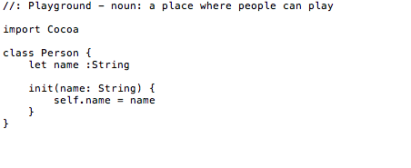
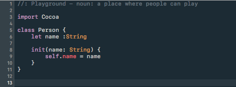
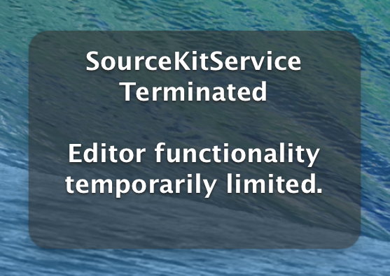
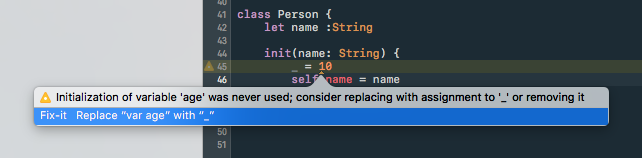
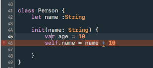
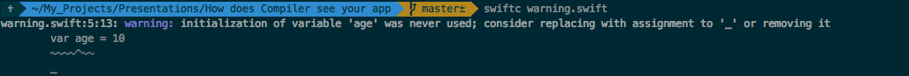
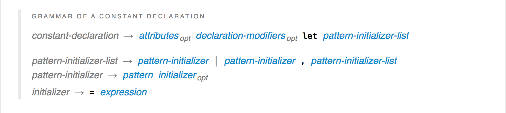
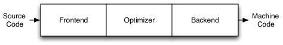
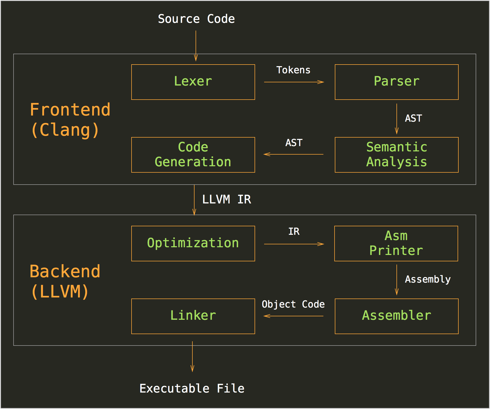

#[fit]How does compiler see your app

---
# What is a compiler

> A compiler is a computer program (or a set of programs) that transforms source code written in a programming language (the source language) into another computer language (the target language) ...

---

# What is a compiler
```swift
Compiler(source code) -> Binary
Compiler(source code) -> Object file .o
Compiler(source code) -> Other source code
Compiler(source code) -> YAML/JSON
```

---

# What is a compiler

- Read the source code
- Analyse the source code
- Optimize
- Transform

---
 
# Why should I learn it -
## Fun  😄🤓

---

# Why should I learn it - 
## Profit

---

# Why should I learn it - 
## Profit

- New CS knowledge
- Build own compiler 
- Building own tools:
  formaters, linters, code coverages, code generators ...

**Bonus:** You will be good at working with `String` in Swift :D
 
---

# Where we use it ?

^ Show here we interact with compiler: source code highlighting, error, warnings, the compiling spinner :D 

---


---

# Syntax highlighting




---

# Code completion


---



---

#[fit] Error + Warning + Fix suggestions 





---
# It's not IDE


`+` Great example of **Business Logic** & **UI** separation

                                                  😀


---

# Let's look inside a compiler 

---

###                                              Source code 
###                                                         ↓

###                                                         ↓
###                                                       App

---

# Frondend & Backend

---

## Frondend

- Lexical analysis
- Syntax analysis
- Semantic analysis
- Generates errors and warnings 
- Generates IR 

---

##

^Reads the source code, divides it into core parts and 
- Checks for lexical, grammar and syntax errors.
The analysis phase generates an intermediate representation of the source program and symbol table, which should be fed to the Synthesis phase as input.

## Backend

- Code independence optimizations
- Generates target-dependent assembly code
- Hardware specific optimizations 
- Machine code 

--- 

# Example

---

#[fit] `let a = 10`

--- 

# 1 - Language grammar

- Finite automata   (`state machine`)
- Regular expression

`let`
 


---

# 2 - Lexical Analysis

`var a = 10`
`<keyword var> <identifier a> <operator => <value 10>` 

`+ + +`
`<operator +> <operator +> <operator +>` 

---

# 3 - Syntax Analysis

- Combines tokens together
- Produces AST

---

```swift
var a = 10
//swiftc -dump-parse hello.swift
```

**AST**

```
source_file
  (top_level_code_decl
    (brace_stmt
      (pattern_binding_decl
        (pattern_named 'a')
        (integer_literal_expr type='<null>' value=10))
))
  (var_decl "a" type='<null type>' storage_kind=stored))
```

---


---

# 4 - Semantic Analysis
`var a: String = 10` 

- Check for correctness
- Type mismatches, method call and arguments, variable refernce, violating access 

^Syntax is correct, but Semantic is wrong!

---

# 5 - Generate IR

- Assembly like
- Language & independent independent




---

# Use LLVM IR & Backend

C, C++, ActionScript, Ada, C#, Common Lisp, Crystal, D, Delphi, Fortran, OpenGL Shading Language, Halide, Haskell, Java bytecode, Julia, Lua, Objective-C, Pony, Python, R, Ruby, Rust, CUDA, Scala, and ... 
## Swift :)

---

# 5 - Generate IR

```swift
func square(a: Int) -> Int {
    return a*a;
}  

//IR
define i32 @square(i32 %a) {
  %1 = mul i32 %a, %a
  ret i32 %1
}
```

---

# 5 - Generate IR
```swift
var a = 10
//swiftc -emit-ir hello.swift
```

```
; ModuleID = 'a'
source_filename = "a"
target datalayout = "e-m:o-i64:64-f80:128-n8:16:32:64-S128"
target triple = "x86_64-apple-macosx10.9"

%Si = type <{ i64 }>
%Vs5Int32 = type <{ i32 }>
%Sp = type <{ i8* }>

@_Tv1a1aSi = hidden global %Si zeroinitializer, align 8
@_TZvOs11CommandLine5_argcVs5Int32 = external global %Vs5Int32, align 4
@globalinit_33_FD9A49A256BEB6AF7C48013347ADC3BA_token4 = external global i64, align 8
@_TZvOs11CommandLine11_unsafeArgvGSpGSqGSpVs4Int8___ = external global %Sp, align 8
@__swift_reflection_version = linkonce_odr hidden constant i16 1
@llvm.used = appending global [1 x i8*] [i8* bitcast (i16* @__swift_reflection_version to i8*)], section "llvm.metadata", align 8

define i32 @main(i32, i8**) #0 {
entry:
  %2 = bitcast i8** %1 to i8*
  store i32 %0, i32* getelementptr inbounds (%Vs5Int32, %Vs5Int32* @_TZvOs11CommandLine5_argcVs5Int32, i32 0, i32 0), align 4
  %3 = load i64, i64* @globalinit_33_FD9A49A256BEB6AF7C48013347ADC3BA_token4, align 8
  %4 = icmp eq i64 %3, -1
  br i1 %4, label %once_done, label %once_not_done

once_not_done:                                    ; preds = %entry
  call void @swift_once(i64* @globalinit_33_FD9A49A256BEB6AF7C48013347ADC3BA_token4, i8* bitcast (void ()* @globalinit_33_FD9A49A256BEB6AF7C48013347ADC3BA_func4 to i8*))
  br label %once_done

once_done:                                        ; preds = %once_not_done, %entry
  %5 = load i64, i64* @globalinit_33_FD9A49A256BEB6AF7C48013347ADC3BA_token4, align 8
  %6 = icmp eq i64 %5, -1
  call void @llvm.assume(i1 %6)
  store i8* %2, i8** getelementptr inbounds (%Sp, %Sp* @_TZvOs11CommandLine11_unsafeArgvGSpGSqGSpVs4Int8___, i32 0, i32 0), align 8
  store i64 10, i64* getelementptr inbounds (%Si, %Si* @_Tv1a1aSi, i32 0, i32 0), align 8
  ret i32 0
}

declare void @globalinit_33_FD9A49A256BEB6AF7C48013347ADC3BA_func4() #0

declare void @swift_once(i64*, i8*)

; Function Attrs: nounwind
declare void @llvm.assume(i1) #1

attributes #0 = { "no-frame-pointer-elim"="true" "no-frame-pointer-elim-non-leaf" "target-cpu"="core2" "target-features"="+ssse3,+cx16,+fxsr,+mmx,+sse,+sse2,+sse3" }
attributes #1 = { nounwind }

!llvm.module.flags = !{!0, !1, !2, !3, !4, !5, !9, !10}

!0 = !{i32 1, !"Objective-C Version", i32 2}
!1 = !{i32 1, !"Objective-C Image Info Version", i32 0}
!2 = !{i32 1, !"Objective-C Image Info Section", !"__DATA, __objc_imageinfo, regular, no_dead_strip"}
!3 = !{i32 4, !"Objective-C Garbage Collection", i32 1024}
!4 = !{i32 1, !"Objective-C Class Properties", i32 64}
!5 = !{i32 6, !"Linker Options", !6}
!6 = !{!7, !8}
!7 = !{!"-lswiftCore"}
!8 = !{!"-lobjc"}
!9 = !{i32 1, !"PIC Level", i32 2}
!10 = !{i32 1, !"Swift Version", i32 4}
```

---

#[fit] 6 - Dive into darkness 
# Backend

---

# Backend - Still a lot of Magic!
- **Analysis and Transform** 🔮
  http://llvm.org/docs/Passes.html
- **Generic optimizations** 
  Dead code elimination, Loop optimizations, etc.
- **Hardware specific optimizations**
 Use of Registers and architecture specific commands, example - armv7s
- Assembly code 

---

^Whole picture



---

# The End!
- swiftc --help
- http://llvm.org
- Youtube - LLVM
- Compiler for dummies :D

---


---
@KostiaKoval
---

