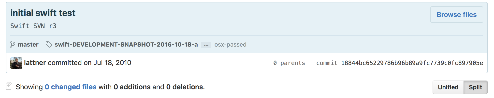
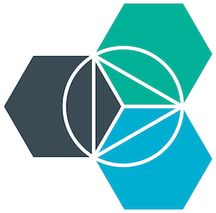
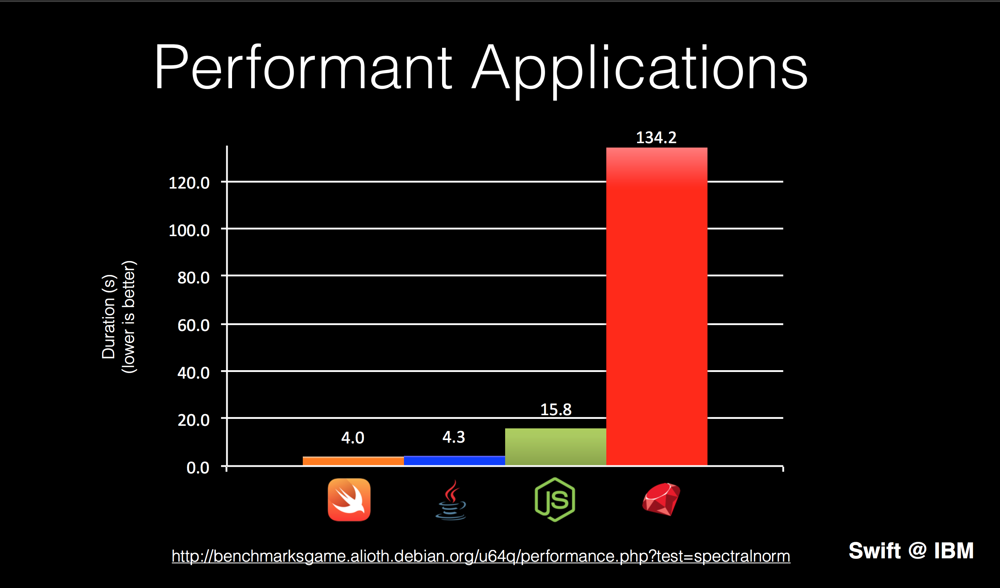
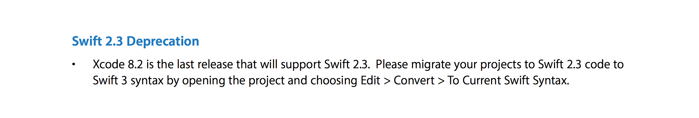

#[FIT] Swift r**E**volution
<br>
<br>
<br>
# Kostiantyn Koval 
# 🐦**@KostiaKoval**

---

# Swift  
<br>
## **Modern** and **Powerful**
## strives for **Simplicity** and **Safety**
## with "C-like" **Performance**


^ why Swift show it's cool features
Maybe remove this slide

---

<br>
<br>
<br>
#[fit] **The Beginning** -? 

---

#  r**Evolution** start
<br>
#                       **Jul 2010**



---

# r**Evolution** start

- "Sat Jul 17 23:50:59 2010 +0000" 
- September 9, 2014 - 🐣 Swift 1.0 
- September 21, 2015 - 💪🐥 Swift 2.0  

^ the new shiny objc with c, and with objective

---


# r**Evolution** start

- "Sat Jul 17 23:50:59 2010 +0000" 
- September 9, 2014 - 🐣 Swift 1.0 
- September 21, 2015 - 💪🐥 Swift 2.0 

# December 3, 2015
#Big Bang -💥💫✨

---
<br>
<br>
<br>
#[fit] Swift - **Open Source**
---

<!--# Why Swift is revolution?
<br>

1. *__OPEN__* language
2. Learning & Teaching & Coding  
3. Tools and Platforms
4. Community - People. 👨, 👩 

^ - My first programing language was Pascal, 
- Tried teach wife C++

--- 
-->
# Open 🔓

1. Source at GitHub, not ~~opensource.apple.com~~
2. Full commit history ~~43,429~~ **43,466 commits** 
3. Commit access
3. New open source projects: swift-protobuf
4. Workflow
5. Evolution and discussions

^ full commit history - That's really a courage
37 commits
Workflow: Jira bugs.swift.org 
Roy talk about objc runtime. How many of you have used objc-runtime opensource

---

#[fit] **Syntax**:  simple - clean - nice 

<br>
<br>

```swift
                  let swift = "🐥"
```

---

#[fit] Learning *&* **Teaching** *&* Coding

- simple - clean - nice **Syntax**
- Swift Playgrounds
- Xcode Playground

---

#[fit] Learning *&* **Teaching** *&* Coding

- simple - clean - nice **Syntax**
- Swift Playgrounds
- Xcode Playground


#[fit] Great as first programming language!

^
- we take for granted other parts 
- Swift is simple and powerful. You can learn basics of programming in swift and write powerful app using same language.
- Perfect as first language to learn
- iPad playgrounds, teaching kids coding
- Easy for developers to read the code 

---

# **Tools** 🛠

- Swift compiler + stdlib 
- foundation, libdispatch 
- xctest
- Swift Package Manager, llbuild
- CI, 🤖, Benchmark
- **More**:    playgrounds, protobuf 

---

#[fit] **Community - People**
<br>

#[fit] 📙 👨🏻 🤓

<br>

^ Knowledge 
Direct access to people that are working on Swift 
Engaging everyone taking part in shaping Swift 
Apple engineers on twitter, mailing list, Jira.

---

# Platforms 
<br>

#              **Mobile** | **Desktop** 
#               **Server** | **Web** 
##                            Embedded

---
# **Platforms**

- iOS and macOS - ****
- Linux - ****
- Web - **IBM** + **** + **Server APIs**
- Android - **Community** + "Brian Gesiak"

### Other
- Raspberrypi, Windows, FreeBSD, PS4, 


^ UI on Linux gui++
CentOS
"for writing the lowest level firmware, up to the highest level application programming. 
make great application programming language first

---

```cpp
static const StringRef OSs[] = {			static const StringRef Arches[] = {
  "OSX",				  					   "arm",
  "tvOS",									   "arm64",
  "watchOS",								   "i386",
  "iOS",									   "x86_64",
  "Linux",									   "powerpc64",
  "FreeBSD",								   "powerpc64le",
  "Windows",								   "s390x"
  "Android",								};
  "PS4",
};

					static const StringRef Endianness[] = {
					  "little",
					  "big"
					};
```

---

# Web 🕸

- Swift@IBM:                    


- Frameworks:       Kitura, Vapor, Perfect, Zewo
- Hosting:                Heroku, AWS, Digital Ocean, Azure
- Performance:      > nodeJS, java, ruby 

^ Kitura, Bluemix, Swift Sandbox, Package Catalogs
 
---

# Web 🕸

- Swift@IBM:                    


- Frameworks:       Kitura, Vapor, Perfect, Zewo
- Hosting:                Heroku, AWS, Digital Ocean, Azure
- Performance:      > nodeJS, java, ruby 
 
#             **Server APIs Project**

---



^ FrenchKit: End to End Application Development with Swift

---

#**Android**

- apple/swift -  
- stdlib + Foundation
- swift-corelibs-libdispatch open PR "#162"
- 🍭🍬🍪 SwiftAndroid 

^ support rivals platform
gradle plugin, JNI (Java Native Interface)

--- 

#**Android**
Requirements: NDK, libiconv-libicu, ....

- swift repo:        100% swift
- SwiftAndroid:   android app + swift lib

<br>
##[fit] **"How we put an app in the Android Play Store using Swift"**


^ Unicode and characters encoding

--- 

#**Android** limitations

- Hard to setup
- No java interoperability
- Community driven 

Not production ready, Yet

---

#[fit] Evolution
<br>
#[fit] Swift is **Young** and
#[fit] **Moves** fast

---

> It is not the strongest that survive, but the one who are willing to adapt
-- **Evolution**

^ The Xcode extension API are swift only

---

#[fit] **Hottest News!!**
#[fit]       **  🔥**

---

#[fit]  Swift **2.3** is Deprecated 

<br>

Xcode 8.2 release notes




---

# Evolution

**apple/swift-evolution -> apple.github.io/swift-evolution**

- 3 major release in 2 years
- 144 Accepted proposals. 1,591 commits
- hundred thousand of emails in mailing list

--- 

# Swift **3.0** 
- 90+ proposals

- Syntax, Syntax, (if let - where, open, fileprivate, ...) 
- Swifty Foundation, GCD and API
- Removed automatic objc-swift bridging
- C and UnsafePointer 
- Swift Package Manager release 🎉

---
#[fit] But  where is **ABI** ?
<br>
#[fit] Not there yet. 
#[fit] We were busy breaking the language 😊

---

# Swift 4.0 🤔
- 🙅🏼‍♂️ No Source breaking changes (unless impacts ABI)
              *hopefully, maybe
  
- ABI
- Stabilization, Resilience
- Generics, String
- Memory ownership

--- 

# What's in **IT** for me?
#[fit] It depends
<br>
#                          😅

---

# What's in **IT** for me?
- Shape the language
- New horizons / platforms
- Cross platforms
- Modern, 100% open Language

---

# Stay up to date with Swift

- **try? Swift**
- Beta
- Newsletters    
- Evolutions 
- Mailing List 🤓 - lists.swift.org

^ Code in Swift, try Swift 
 Swift Weekly Brief - Jesse Squires
 "Swift Weekly Brief", This week in Swift", Server-Side Swift


---

#Thanks
<br>
<br>
#         		         **Questions**?

<br>
#### @KostiaKoval

