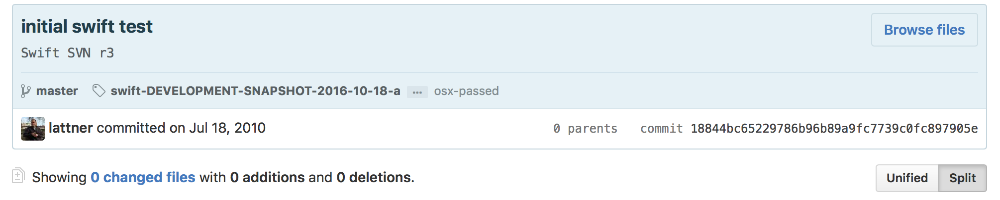

#[FIT] Swift r**E**volution
 
 
 
# Kostiantyn Koval 
# 🐦**@KostiaKoval**

---

# Swift? 
**Awesome**, Application programming language that embrace: 
#[fit] **Safety**, **Performance**, **Simplicity** 

^ why Swift show it's cool features
Maybe remove this slide

---

# r**Evolution** start

- "Sat Jul 17 23:50:59 2010 +0000" 
 == 16:50:59 - San Francisco time 
 == Sun Jul 17 1:50:59 - Łódź

---

# r**Evolution** start

- "Sat Jul 17 23:50:59 2010 +0000" 
- September 9, 2014 - 🐣 Swift 1.0 
- September 21, 2015 - 💪🐥 Swift 2.0  

---

# r**Evolution** start

- "Sat Jul 17 23:50:59 2010 +0000" 
- September 9, 2014 - 🐣 Swift 1.0 
- September 21, 2015 - 💪🐥 Swift 2.0 

# December 3, 2015
#Big Bang -💥💫✨

---

# Why Swift is revolution?
 

1. *__OPEN__* language
2. Learning & Teaching & Coding  
3. Platform and Tools
4. Community 

--- 

# Open 🔓

1. Source code at GitHub
2. Full commit history **(add numbers of commits)**
3. Commit access
3. New open source projects: protobuf
4. Workflow
5. Evolution and discussions

---

#[fit] Learning *&* **Teaching** *&* Coding

- simple - clean - nice **Syntax**
- Xcode Playground
- Swift Playgrounds

#[fit] Great as first programming language!

^
- we take for granted other parts 
- Swift is simple and powerful. You can learn basics of programming in swift and write powerful app using same language.
- Perfect as first language to learn
- iPad playgrounds, teaching kids coding
- Easy for developers to read the code 

---

# **Tools** 🛠

- Swift compiler + stdlib 
- foundation, libdispatch 
- llbuild
- xctest
- Swift Package Manager
- CI 🤖, Benchmark
- **More**:    playgrounds, protobuf 

---

# **Community**

- Apple engineers on twitter, mailing list, jira.
- Open bugs at jira.

^ Direct access to people that are working on Swift 

---

# **Platforms**

- iOS and macOS, and all **** platforms - ****
- Linux - ****
- Linux + Web - **IBM** + **OpenSource community**
- Android - **OpenSource community** + "Brian Gesiak"

### Other
- Raspberrypi, Windows, FreeBSD, PS4, 

---

#Web

- IBM swift on web, Kitura, etc
- production ready.
- great performance. > nodeJS, java, ruby

## Libs
Kitura, Vepor, Perfect, **ADD MORE**

---

#**Android**

- Merged to Swift repo by Apple 
- Swift stdlib + Foundation is available on Android 
- swift-corelibs-libdispatch open 
      "swift-corelibs-libdispatch/pull/162"

--- 

#**Android**

- swift repo: Android executable 100% swift
- other: make swift lib and include it to android app.
- NDK, some libs, 

### limitations:
- no java interoperability,
- community driven, 
- hard to setup and use. 
- ...

---

#[fit] Evolution
 
#[fit] Swift is **Young** and
#[fit] **Moves** fast

---

- 3 major release in X years
- hundred tousent of emails in mailing list
- X proposals 

--- 

# Swift 2.3
- Stabilization and Fixes
 Collections, String

--- 

# Swift **3.0** 
- x proposals

- Syntax, Syntax, (were , open, fileprivate, ...) 
- Swifty Foundation, GCD and API
- Removed automatic objc-swift bridging
- C and UnsafePointer 
- Swift Package Manager released

---
#[fit] But where is **Swift 3.0 ABI** ?
 
#[fit] Not there yet. 
#[fit] But!  - It's coming 😊

---

# Swift 4.0 🤔
- ABI
- Stabilization
- Generics
- 🙅🏼‍♂️ No Source breaking changes (unless impacts ABI)
- Add link to Swift evolution swift 4 plan description

--- 

> Not the strongest that survive, but the ones who are willing to adapt
-- **Evolution**

---

# What's in **it** for me?

- Modern, 100% open Language
- Multiplatform support

---

# Stay up to date with Swift

- Code in Swift. **try? Swift**
- Newslatter: 
      "Swift Weekly Brief", This week in Swift", server side swift
- Evolutions
- Mailing List 🤓

---

---

1. What is swift (swift parts)
2. Swift platforms support (iOS, android, web, arm, etc)
3. Swift evolution (how it evolves, where it's now what will be next)
4. How to work and interact with evolution, 

1 what is swift: 
      What is Swift? Why Swift is revolution (Why and How)  
- open language (all its open part) .  "Secret company - being Open"
- Teaching (iPad playgrounds, easy learning curve)
- Set of tools (swift, core-foundation, xctest, swiftpm, protobuf, llbuild, playgrounds)
- Community, Apple engineers (mailing list)

1.1 open language 
    - All Source code at github, with open PR and discussions (Swift, core-libs, swiftpm, evolution, protobuf, xctesting) 
  - full commit history 
  - commit access to other people.
  - more repos are being open sourced 
   - Open jira with issues and workflow
   - evolution, proposals and discussions 
   - discussion at mailing list

1.2 Teaching (iPad playgrounds, easy learning curve)
- Swift is simple and powerful. You can learn basics of programming in swift and write powerful app using same language.
- Perfect as first language to learn
- iPad playgrounds, teaching kids coding
- Easy for developers to read the code 

1.3 Set of tools (swift, core-foundation, xctest, swiftpm, protobuf, llbuild, playgrounds)
- swift compiler with stdlib
- Foundation, xctests
- Swift package manager
- More libs and tools are added: playgrounds, protobuf 

1.3 Community, Apple engineers (mailing list)
- Apple engineers on twitter, mailing list, jira.
- Open bugs at jira.

2 swift platforms 
- iOS and macOS 
       - main Apple focus, swift - objc interoperability
- Web, Linux (supported by Apple and IBM)
        - Linux - big support by Apple, compiler, swiftpm designed for Linux and web
        - IBM swift on web, Kitura, etc
       -  production ready, many libs, IBM 
       - great performance, better than node, java, ruby
- Android 
      - merged to Swift repo by Apple 
      - swift Foundation is available on Android 
       - swift repo - make android executable in swift
       - make swift lib and include it to android app.
        - NDK, some libs, 
         - limitations: no java interoperability, community driven, hard to setup and use. 
- Other: raspberrypi, Windows, FreeBSD, PS4, 
- Apple is open for platforms support
- now swift focus on being good Application programming language, in future - Low level, hardware. Swift is like c by performance characteristics, but easier to write

3 swift evolution
- swift evolves FAST 
 