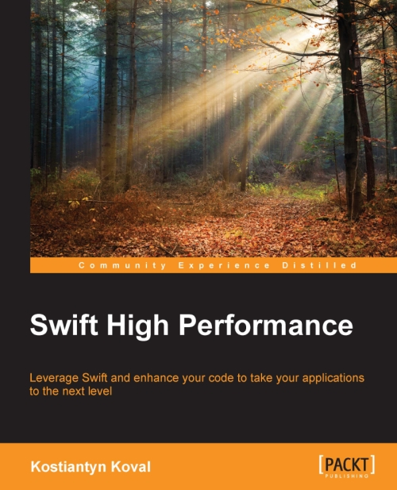

autoscale: true
# Swift High Performance 

---



---

> High Performance
-- Is very interesting

---

## Choice
# **Fast** | **Slow**

---

> "Premature optimization is the root of all evil"
-- Donald Knuth

---

> "Don't optimize upfront"

---

> "The First Rule of Program Optimization: Don't do it.
-- Michael A. Jackson

---

###[fit]**    Result**     
<br>
#[fit]**'X'** can't handle my scale

--- 

#[fit] Be Openminded
<br>
#[fit] Think Different 

---

# 2 Types of Performance:
<br>
#[fit] Executional | Operational
 
--- 


# 2 Types of Performance:

1. **Executional**
 - CPU, GPU, FPS 
 - 
 - Memory usage
 - 
 - How much time does feature '_x_' takes to run
 - 
2. Operational
 - Adding / Removing a feature
 - 
 - Stability
 - 
 - Scaling
 -  

--- 

#[fit]Modern Optimization

> A code change that improves its execution performance and make it more readable stable and secure as well.
-- Kostiantyn Koval


--- 

> High Performance + Swift
-- Its delicious 😋🌯

---

# - Smart Compiler
# - Methods Dispatch
# - Memory operations

---

# Methods

---

## Methods
# **Dynamic** | **Static**

---

```swift
class Shape {
    func draw() {
      ...
    }

	final func drawBg() {
	   ...
   }
}

class Line: Shape {
    override func draw() {
       ...
    }
    static func drawLine() {
        print("draw Line")
    }
}
```

---
# Dynamic 

```swift
var shape = Line()
shape.draw

Line  							Shape 
----- 							----- 
0x2 --- vars 					0x4 --- vars
0x3 --- methods 				0x5 --- methods
 ["draw"   : 0x101,			 	["draw"   : 0x103,
  "drawLine" : 0x102]		  	 "drawBg" : 0x104]

--- 							---
Methods  						Methods 
0x101 -> Line_draw_IMP 			0x103 -> Shape_draw_IMP
0x102 -> Line_drawLine_IMP 		0x104 -> Shape_drawBg_IMP

``` 

---
# Dynamic Dispatch (objc)
```swift
var shape = Line()
shape.draw()
```

1. Look if `draw` implementation is in the Cache
2. If `!` -> Get method IMP from methods HashMap,
3. If nil -> Repeat steps 1 and 2 for superclass
4. If nil, Throw error. "Object doesn't respond to Selector"
5. If not nil -> save to Cache, call it.

---
# Static (v-table) Swift


```swift

let shape = Line()
shape.draw() // shape.vtable[0].call 
shape.drawLine() // 0x102

Line  							Shape 
----- 							----- 
0x2 --- vars 					0x4 --- vars
0x3 --- vtable 					0x5 --- vtable
 [0x101]						 [0x103]		
 

--- 							---
Methods  						Methods 
0x101 -> Line_draw_IMP 			0x103 -> Shape_draw_IMP
0x102 -> Line_drawLine_IMP 		0x104 -> Shape_drawBg_IMP
``` 

---

# Static Dispatch (Swift)

1. Non virtual methods get inlined
2. Virtual methods are stored in array.
   Access by index
 
---

# Swift methods
```swift
func call() { }

class A {
    static func s() { } // final class
    class func c() { }
    
    final func callMe() { }
    func doIt() { }
}

call()  		// -> call 0x10374
A.s()   		// -> call 0x98454
A.c()   		// -> call 0x02862 or A.vtable[0]

// need to allocate an instance. 
A().callMe() 	// -> call 0x98454 + pass instance
A().doIt() 		// -> call 0x02862 + pass instance or A.vtable[0]

```

---

1. **Make func `final`.** 
   **+** Compile and runtime
2. **Use static func**
	**+** Runtime and security
3. **Struct methods are final by default** 
4. **Protocols adds vtable lookup** 
5. **Don't inherit from Objc. It ass dynamic dispatch** 

---

# Memory

---
## Memory     

- Stack & Heap
- Value & Reference 
- Struct & Class 

---

## Swift types     

```swift
let ar = [1, 2, 3] 

Stack 			Heap
---  			--- 
0x0: 1 			0x0: 0x9545
0x1: 2 			0x1: 0x0123
0x1: 2 			0x2: 0x7421

Stack
ar[0]+10 // *(0x0) + 10

Heap
ar[0]+10 // *(loadMemory(0x9545)) + 10

```

---
# Why use value types

- One owner, not shared.
- No alloc and dealloc
- Faster access
- Better Optimization 

---

# Compiler is Extremely smart 


---
# Hide things

```swift
class ReportLoader {
  func load() -> Report
  func save(report: Report)
  ...
}

private extension ReportLoader {
  func path() -> String
  ...
} 

```
**+** Compile Time & Stability

---


# Keep it simple
```swift
struct Point {
    let x: Int
    let y: Int
}
struct Move {
    let x: Int
    let y: Int
}

let moves: [Move]

var point = Point(x: 10, y: 20)
for move in moves {
    point = Point(x: point.x + move.x, y: point.y + move.y)
}

```

---

# Keep it simple
- Simple Types and Functions
- Reduce memory usage
- Better compiler optimization


--- 
# Don't use Pointers and raw memory
```swift
let numberPtr = UnsafeMutablePointer<Int>.alloc(1000)
...
numberPtr.dealloc(1000)

//Swift Array
var array = Array(count: 1000, repeatedValue: 0)
array[10]

```

---

# Remove print

```swift
for i in 0...1_000_000 {
 let view = UIView()
  // print(view)
}

```

---

# Don't overuse lazy

```swift
let a: Int = 10
struct ReportSender {
    static var sent = fetchSentCount()
    lazy var sender = Sender()
}
```

---
# Use noescape

```swift
func map<T>(@noescape transform: (Element) -> T)-> [T]
```

---

# There is much More ... 

---
Kostiantyn Koval 
## Amazon -> Swift High Performance
## [SwiftHighPerformance.com](www.SwiftHighPerformance.com)
##  @KostiaKoval
<br>
## Q? 🤔